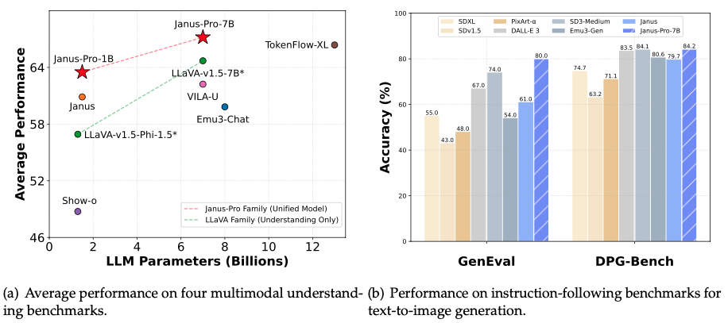

# HKU Architecture Guide

## Project Proposal

The Visual Input to HKU Architecture Guide is an AI assistant enabling visitors to explore HKU’s campus by submitting images/questions for real-time insights. 

It employs object detection/segmentation to recognize buildings, RAG to access HKU’s architectural database, and LLMs to deliver concise, contextual answers about history, design, and cultural significance. 

Hosted on a full-stack platform, it replaces static guides with dynamic interaction, enhancing accessibility while reducing logistical burdens. By bridging visual input and AI-driven analysis, the project redefines campus tourism, aligning with HKU’s smart-campus vision and offering a blueprint for AI-enhanced cultural education.

## 1. Introduction


The project is now finetuned on deepseek/JanusPro-7B



## 2. Quick Start

```bash
pip install -r requirements.txt
```